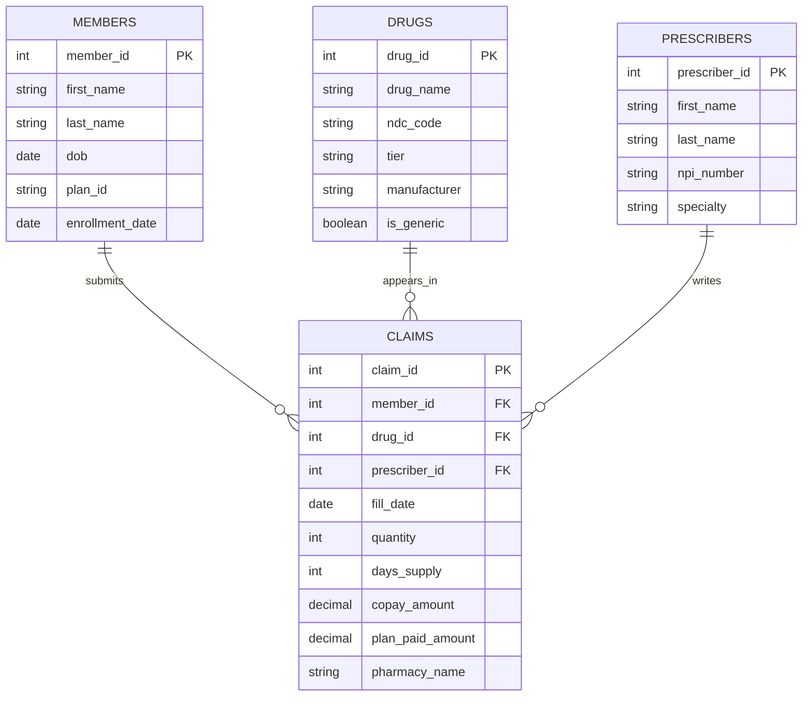

# PBM Solutions – Pharmacy Benefit Management Database Design

A relational database design for a hypothetical pharmacy benefit management (PBM) company, **PBM Solutions**, which manages prescription drug benefits on behalf of client organizations (employers, health plans, etc.).

This project demonstrates core RDBMS design principles — entity modeling, normalization, primary/foreign key relationships, and query design — applied to a realistic healthcare use case.

## Overview

PBM Solutions needs to track:
- **Members** enrolled under a client's pharmacy benefit plan
- **Drugs** covered under the plan formulary
- **Prescribers** (physicians) who write prescriptions
- **Claims** generated when a member fills a prescription

The database enables the company to process claims, verify member eligibility, apply formulary-based pricing, and generate reporting for its clients.

## Entity Relationship Diagram



## Tables

| Table | Description | Primary Key |
|---|---|---|
| `members` | Individuals enrolled under a client's pharmacy benefit plan | `member_id` |
| `drugs` | Formulary of medications covered under plans | `drug_id` |
| `prescribers` | Physicians/providers who write prescriptions | `prescriber_id` |
| `claims` | Transactional records generated when a member fills a prescription | `claim_id` |

## Relationships

| Relationship | Cardinality | Description |
|---|---|---|
| Members → Claims | 1 : ∞ | One member can submit many claims |
| Drugs → Claims | 1 : ∞ | One drug can appear on many claims |
| Prescribers → Claims | 1 : ∞ | One prescriber can write many claims |

`claims` is the central transactional table, referencing the three reference tables (`members`, `drugs`, `prescribers`) via foreign keys — a classic hub-and-spoke relational structure.

**Notation:** `PK` = primary key, `FK` = foreign key. `||--o{` indicates a one-to-many relationship (exactly one on the left, zero or more on the right).

## Design Notes

- **Claims as the central hub**: nearly every meaningful business question (cost per member, utilization by drug tier, prescriber patterns) requires joining through `claims`, so it was modeled as the fact table with foreign keys to the three dimension tables.
- **NDC code on `drugs`, not `claims`**: the National Drug Code identifies the specific medication and belongs to the drug's own identity, not the transaction — this avoids duplicating drug attributes across every claim row (2nd/3rd normal form).
- **`plan_id` on `members`**: kept as a simple attribute here since plan details are out of scope for this example; in a production schema this would likely become its own `plans` table with its own foreign key relationship.
- **Separate `copay_amount` and `plan_paid_amount`**: split intentionally so the schema can support reporting on member cost-share vs. plan liability independently, which is a common PBM reporting requirement.

## Repository Structure

```
pbm-database-design/
├── README.md
├── LICENSE
├── docs/
│   └── erd.md          # ERD + relationships reference
├── sql/
│   ├── schema.sql       # Table creation scripts
│   └── queries.sql      # Sample analytical queries
└── sample_data/          # (optional) seed data for testing
```

## How to Use

1. Clone the repository.
2. Run `sql/schema.sql` against a PostgreSQL (or compatible) database to create the tables.
3. (Optional) Load sample data from `sample_data/` if provided.
4. Run the queries in `sql/queries.sql` to explore common PBM reporting use cases.

```bash
psql -U your_username -d your_database -f sql/schema.sql
```

## Tech Stack

- SQL (PostgreSQL syntax, portable to most RDBMS with minor adjustments)
- Mermaid.js for ERD documentation

## License

This project is licensed under the MIT License — see [LICENSE](LICENSE) for details.
