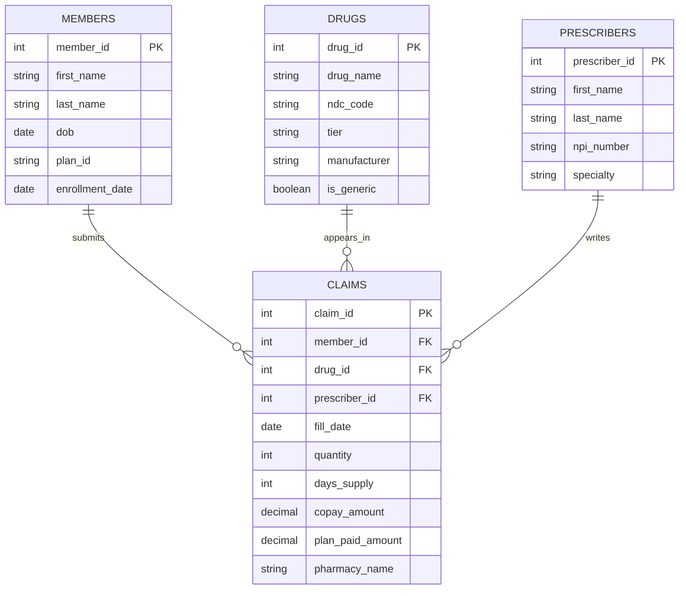

# PMB Solutions – Database Schema

Entity relationship diagram for the PMB Solutions pharmacy benefit management database. `CLAIMS` is the central transactional table, linked by foreign key to `MEMBERS`, `DRUGS`, and `PRESCRIBERS`.

## Relationships

| Relationship | Cardinality | Description |
|---|---|---|
| Members → Claims | 1 : ∞ | One member can submit many claims |
| Drugs → Claims | 1 : ∞ | One drug can appear on many claims |
| Prescribers → Claims | 1 : ∞ | One prescriber can write many claims |

**Notation:** `PK` = primary key, `FK` = foreign key. `||--o{` indicates a one-to-many relationship (exactly one on the left, zero or more on the right).
